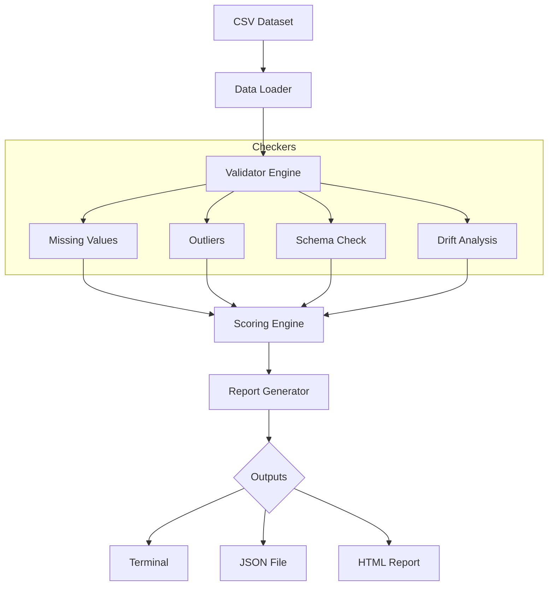

# 📊 Data Quality Monitor


**Data Quality Monitor** is a lightweight Python CLI tool designed to automatically detect data quality issues in CSV datasets before they enter your Data Science or Machine Learning pipelines.

---

## 🚀 Overview

Data Quality Monitor is a modular and extensible validation tool that analyzes datasets and generates structured reports directly in your terminal or as **JSON** and **HTML** exports.

It ensures your data is clean, consistent, and reliable before being used in downstream data engineering or predictive modeling workflows.

---

## 🎯 Why This Project Matters

Poor data quality is the leading cause of failure in ML systems. This tool helps you:

*   **Detect anomalies** early in the development cycle.
*   **Improve reliability** of downstream models by reducing noise.
*   **Standardize** validation workflows across teams.
*   **Generate automated reports** for technical documentation.

---

## ⚙️ Key Features

| Component   | Description |
|------------|-------------|
| **Metrics Engine** | Missing value detection and outlier detection using the IQR method |
| **Validation Layer** | Schema validation (data types) and basic data drift analysis |
| **Reporting System** | Structured console output with JSON and HTML report generation |
| **Architecture** | Modular and extensible design with a centralized scoring engine (0–100) |
| **Testing Suite** | Full coverage with unit, integration, and regression tests |

---

## 🧱 Architecture



---

## 🚀 Quick Start

### 1. Installation
```bash
# Clone the repository
git clone [https://github.com/abramo0/Data-Quality-Monitor.git](https://github.com/abramo0/Data-Quality-Monitor.git)
cd Data-Quality-Monitor

# Set up the virtual environment
python3 -m venv venv
source venv/bin/activate  # On Windows use: venv\Scripts\activate

# Install dependencies
pip install -r requirements.txt
```

### 2. Usage
```bash
# Basic analysis
python3 main.py --file data/raw/data.csv

# Full analysis with JSON and HTML exports
python3 main.py --file data/raw/data.csv --export report.json --html report.html
```

---

## 📊 Example Console Output

```text
============================================================
📊 DATA QUALITY REPORT
============================================================

MISSING VALUES
name    0    0.0%    ✅ OK
age     1    33.33%  ⚠️ WARNING

OUTLIERS
salary  2    5.20%   ⚠️ WARN

SCHEMA
name    object       ✅ MATCH
salary  int64        ✅ MATCH

FINAL SCORE: 87.4 / 100
STATUS: GOOD
============================================================
```

---

## 📁 Project Structure

```text
data-quality-monitor/
├── src/
│   ├── core/           
│   │   ├── loader.py        # Data loading utilities
│   │   ├── validator.py     # Main validation pipeline
│   │   ├── drift.py         # Data drift detection logic
│   │   └── score.py         # Data quality scoring engine
│
│   ├── metrics/        
│   │   ├── missing.py       # Missing values analysis
│   │   ├── outliers.py      # Outlier detection (IQR method)
│   │   └── schema.py        # Schema validation (dtype checks)
│
│   ├── report/         
│   │   ├── generator.py     # Console + JSON report generation
│   │   └── html_generator.py # HTML report rendering
│
│   └── utils/          
│       ├── config.py        # YAML configuration loader
│       └── logger.py        # Logging utilities
│
├── data/
│   ├── raw/               # Raw input datasets
│   └── processed/        # Cleaned/processed datasets
│
├── configs/
│   └── config.yaml       # Thresholds and global settings
│
├── tests/
│   ├── unit/             # Unit tests for each module
│   ├── integration/      # Full pipeline tests
│   ├── regression/       # Prevent score/logic regression
│   └── fixtures/         # Sample datasets for testing
│
├── main.py               # CLI entry point
├── requirements.txt      # Dependencies
└── README.md
---

## 🛠️ Tech Stack

*   **Core:** Python, Pandas
*   **CLI:** Argparse
*   **Testing:** Pytest
*   **Reporting:** Jinja2, Logging

---

---

## 🧪 Testing

To run the tests and ensure everything is working correctly:
```bash
pytest
```

---

## 🚀 Future Improvements

- [ ] Interactive dashboard using **Streamlit**.
- [ ] Advanced Drift detection (PSI, KS test).
- [ ] **Docker** support for containerized execution.
- [ ] CI/CD pipeline integration via GitHub Actions.

---

## 🤝 Contributing

Contributions are welcome! 

1. **Fork** the project.
2. Create a feature branch (`git checkout -b feature/AmazingFeature`).
3. **Commit** your changes (`git commit -m 'Add AmazingFeature'`).
4. **Push** to the branch (`git push origin feature/AmazingFeature`).
5. Open a **Pull Request**.

---

## 📄 License

Distributed under the MIT License. See `LICENSE` for more information.

---

## 👨‍💻 Author

**Abramo Azer**
*Aspiring Data Engineer & AI Engineer*

[](https://www.linkedin.com/in/abramo-azer-229610299/)
[](https://github.com/abramo0)

---

## 📌 Status
**Current Status:** Under active development. Modular validation pipeline and scoring system implemented.
```
