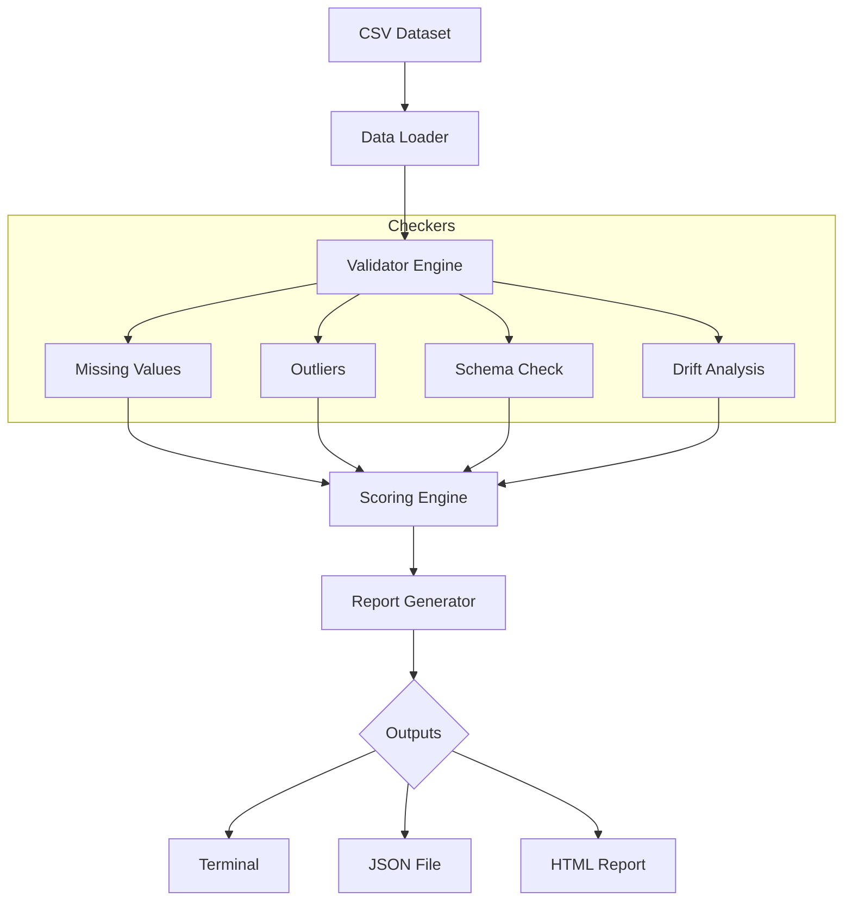

# 📊 Data Quality Monitor


**Data Quality Monitor** è un tool CLI leggero in Python progettato per automatizzare il rilevamento di problemi di integrità nei dataset CSV, garantendo dati puliti e affidabili per le tue pipeline di Data Science e Machine Learning.

---

## 🚀 Overview

Data Quality Monitor è uno strumento modulare ed estensibile che analizza i dataset e genera report strutturati direttamente nel terminale o esportabili in **JSON** e **HTML**. 

Assicura che i dati siano consistenti prima di alimentare processi di data engineering o modelli predittivi.

---

## 🎯 Perché questo progetto?

La scarsa qualità dei dati è la causa principale del fallimento dei sistemi ML. Questo tool permette di:

*   **Identificare anomalie** precocemente nel ciclo di sviluppo.
*   **Migliorare l'affidabilità** dei modelli downstream.
*   **Standardizzare** i flussi di validazione.
*   **Generare report** pronti per la documentazione tecnica.

---

## ⚙️ Caratteristiche Principali

| Feature | Descrizione |
| :--- | :--- |
| **Checkers** | Rilevamento valori mancanti e outlier (metodo IQR). |
| **Validation** | Controllo degli schemi (dtype) e analisi del data drift. |
| **Reporting** | Output testuale in console, export JSON e HTML interattivo. |
| **Architecture** | Sistema a plugin modulare con Scoring Engine integrato. |
| **Reliability** | Suite completa di test unitari, di integrazione e di regressione. |

---

## 🧱 Architettura



---

## 🚀 Quick Start

### 1. Installazione
```bash
# Clona il repository
git clone [https://github.com/abramo0/Data-Quality-Monitor.git](https://github.com/abramo0/Data-Quality-Monitor.git)
cd Data-Quality-Monitor

# Configura l'ambiente virtuale
python3 -m venv venv
source venv/bin/activate  # Su Windows usa: venv\Scripts\activate

# Installa le dipendenze
pip install -r requirements.txt
```

### 2. Esecuzione
```bash
# Analisi base
python3 main.py --file data/raw/data.csv

# Analisi con export completo (JSON e HTML)
python3 main.py --file data/raw/data.csv --export report.json --html report.html
```

---

## 📊 Esempio Output Console

```text
============================================================
📊 DATA QUALITY REPORT
============================================================

MISSING VALUES
name    0    0.0%    ✅ OK
age     1    33.33%  ⚠️ WARNING

OUTLIERS
salary  2    5.20%   ⚠️ WARN

SCHEMA
name    object       ✅ OK
salary  int64        ✅ OK

FINAL SCORE: 87.4 / 100
STATUS: GOOD
============================================================
```

---

## 📁 Struttura del Progetto

```text
data-quality-monitor/
├── src/
│   ├── core/           # Core logic (loader, validator, drift, score)
│   ├── metrics/        # Checkers specifici (missing, outliers, schema)
│   ├── report/         # Logica di generazione report
│   └── utils/          # Configurazione e logger
├── data/               # Dataset raw e processati
├── configs/            # File di configurazione YAML
├── tests/              # Test suite (unit, integration, regression)
├── main.py             # Entry point dell'applicazione
└── requirements.txt    # Dipendenze Python
```

---

## 🛠️ Tech Stack

*   **Core:** Python, Pandas
*   **CLI:** Argparse
*   **Testing:** Pytest
*   **Reporting:** Jinja2, Logging

---

## 🧪 Testing

Per eseguire i test ed assicurarti che tutto funzioni correttamente:
```bash
pytest
```

---

## 🚀 Sviluppi Futuri

- [ ] Dashboard interattiva con **Streamlit**.
- [ ] Supporto avanzato al Drift detection (PSI, KS test).
- [ ] Containerizzazione con **Docker**.
- [ ] Pipeline CI/CD con GitHub Actions.

---

## 🤝 Contribuire

Le contribuzioni sono benvenute! 

1. Fai il **Fork** del progetto.
2. Crea un feature branch (`git checkout -b feature/NuovaFeature`).
3. Fai il **Commit** delle modifiche (`git commit -m 'Aggiunta NuovaFeature'`).
4. Fai il **Push** sul branch (`git push origin feature/NuovaFeature`).
5. Apri una Pull Request.

---

## 📄 Licenza

Distribuito sotto Licenza MIT. Vedi il file `LICENSE` per dettagli.

---

## 👨‍💻 Autore

**Abramo Azer**
*Aspiring Data Engineer & AI Engineer*

[](# 📊 Data Quality Monitor


**Data Quality Monitor** è un tool CLI leggero in Python progettato per automatizzare il rilevamento di problemi di integrità nei dataset CSV, garantendo dati puliti e affidabili per le tue pipeline di Data Science e Machine Learning.

---

## 🚀 Overview

Data Quality Monitor è uno strumento modulare ed estensibile che analizza i dataset e genera report strutturati direttamente nel terminale o esportabili in **JSON** e **HTML**. 

Assicura che i dati siano consistenti prima di alimentare processi di data engineering o modelli predittivi.

---

## 🎯 Perché questo progetto?

La scarsa qualità dei dati è la causa principale del fallimento dei sistemi ML. Questo tool permette di:

*   **Identificare anomalie** precocemente nel ciclo di sviluppo.
*   **Migliorare l'affidabilità** dei modelli downstream.
*   **Standardizzare** i flussi di validazione.
*   **Generare report** pronti per la documentazione tecnica.

---

## ⚙️ Caratteristiche Principali

| Feature | Descrizione |
| :--- | :--- |
| **Checkers** | Rilevamento valori mancanti e outlier (metodo IQR). |
| **Validation** | Controllo degli schemi (dtype) e analisi del data drift. |
| **Reporting** | Output testuale in console, export JSON e HTML interattivo. |
| **Architecture** | Sistema a plugin modulare con Scoring Engine integrato. |
| **Reliability** | Suite completa di test unitari, di integrazione e di regressione. |

---

## 🧱 Architettura


---

## 🚀 Quick Start

### 1. Installazione
```bash
# Clona il repository
git clone [https://github.com/abramo0/Data-Quality-Monitor.git](https://github.com/abramo0/Data-Quality-Monitor.git)
cd Data-Quality-Monitor

# Configura l'ambiente virtuale
python3 -m venv venv
source venv/bin/activate  # Su Windows usa: venv\Scripts\activate

# Installa le dipendenze
pip install -r requirements.txt
```

### 2. Esecuzione
```bash
# Analisi base
python3 main.py --file data/raw/data.csv

# Analisi con export completo (JSON e HTML)
python3 main.py --file data/raw/data.csv --export report.json --html report.html
```

---

## 📊 Esempio Output Console

```text
============================================================
📊 DATA QUALITY REPORT
============================================================

MISSING VALUES
name    0    0.0%    ✅ OK
age     1    33.33%  ⚠️ WARNING

OUTLIERS
salary  2    5.20%   ⚠️ WARN

SCHEMA
name    object       ✅ OK
salary  int64        ✅ OK

FINAL SCORE: 87.4 / 100
STATUS: GOOD
============================================================
```

---

## 📁 Struttura del Progetto

```text
data-quality-monitor/
├── src/
│   ├── core/           # Core logic (loader, validator, drift, score)
│   ├── metrics/        # Checkers specifici (missing, outliers, schema)
│   ├── report/         # Logica di generazione report
│   └── utils/          # Configurazione e logger
├── data/               # Dataset raw e processati
├── configs/            # File di configurazione YAML
├── tests/              # Test suite (unit, integration, regression)
├── main.py             # Entry point dell'applicazione
└── requirements.txt    # Dipendenze Python
```

---

## 🛠️ Tech Stack

*   **Core:** Python, Pandas
*   **CLI:** Argparse
*   **Testing:** Pytest
*   **Reporting:** Jinja2, Logging

---

## 🧪 Testing

Per eseguire i test ed assicurarti che tutto funzioni correttamente:
```bash
pytest
```

---

## 🚀 Sviluppi Futuri

- [ ] Dashboard interattiva con **Streamlit**.
- [ ] Supporto avanzato al Drift detection (PSI, KS test).
- [ ] Containerizzazione con **Docker**.
- [ ] Pipeline CI/CD con GitHub Actions.

---

## 🤝 Contribuire

Le contribuzioni sono benvenute! 

1. Fai il **Fork** del progetto.
2. Crea un feature branch (`git checkout -b feature/NuovaFeature`).
3. Fai il **Commit** delle modifiche (`git commit -m 'Aggiunta NuovaFeature'`).
4. Fai il **Push** sul branch (`git push origin feature/NuovaFeature`).
5. Apri una Pull Request.

---

## 📄 Licenza

Distribuito sotto Licenza MIT. Vedi il file `LICENSE` per dettagli.

---

## 👨‍💻 Autore

**Abramo Azer**
*Aspiring Data Engineer & AI Engineer*

[](https://www.linkedin.com/in/abramo-azer-3331b225a/)
[](https://github.com/abramo0)

---

## 📌 Status
**Stato attuale:** In fase di sviluppo attivo. Pipeline di validazione modulare e sistema di scoring implementati.)
[](https://github.com/abramo0)

---

## 📌 Status
**Stato attuale:** In fase di sviluppo attivo. Pipeline di validazione modulare e sistema di scoring implementati.
